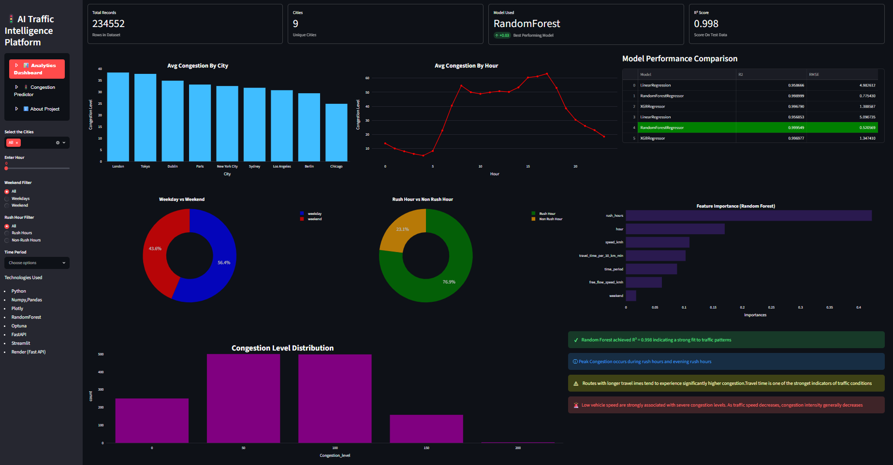
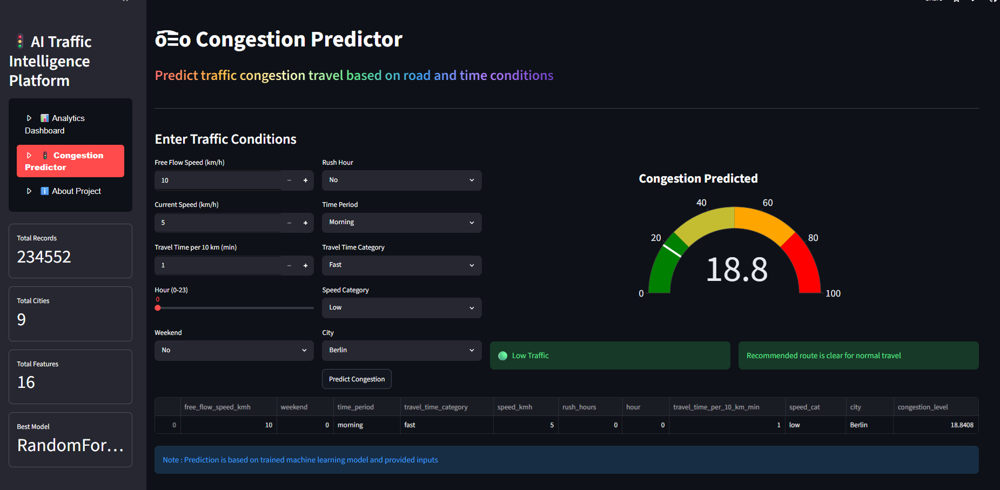
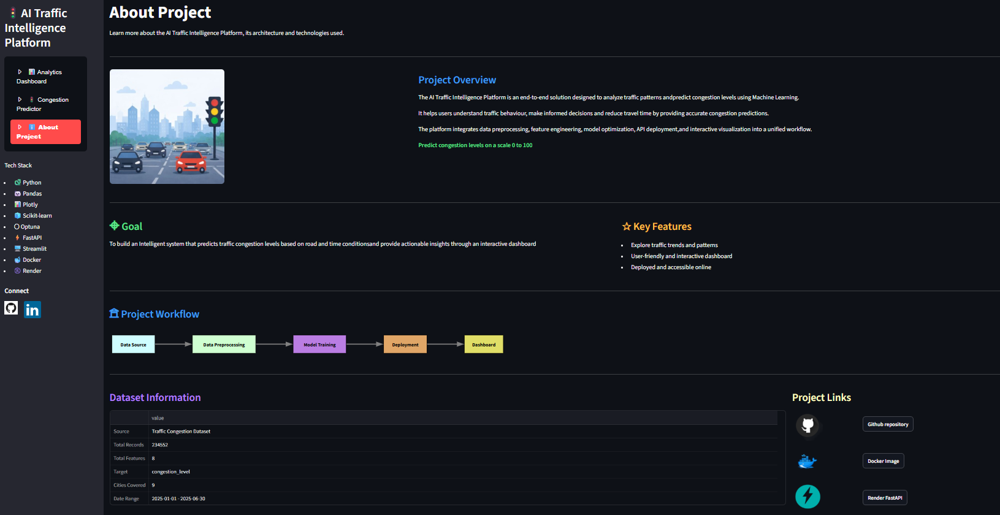
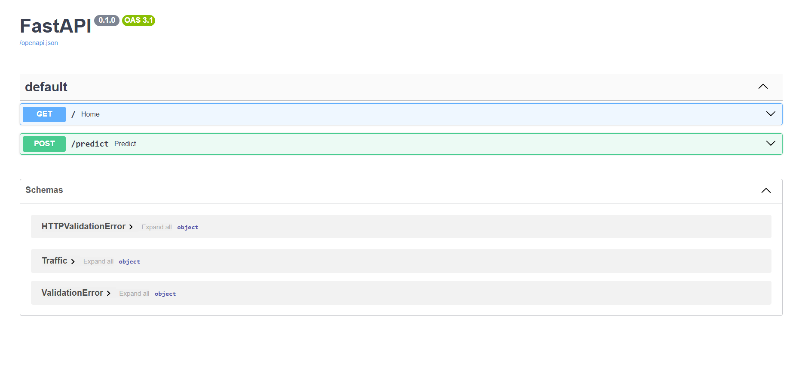

# 🚦 Traffic Congestion Prediction

A machine learning project that predicts traffic congestion levels using passed traffic data. This project has complete data science and deployment lifecycle, from data collection and preprocessing to API deployment and interactive web application development.

## 📌 Overview
The goal of this project is to predict traffic congestion levels based on various traffic, cities, and timeline factors. The project was developed using publicly available online datasets and follows an end-to-end machine learning workflow.

## 🔄 Project Workflow

---

### 💾 Data Collection
- Gathered multiple publicly available traffic-related datasets.
- Combined datasets into a unified dataset for analysis and modeling.

### 🧹 Data Cleaning & Preprocessing
- Handled missing values and duplicates.
- Processed categorical and numerical features.
- Performed feature engineering to create meaningful predictors.

### 📊 Exploratory Data Analysis (EDA)
- Analyzed traffic patterns and congestion trends.
- Identified relationships between features and congestion levels.
- Visualized key insights using charts and statistical summaries.

### ⚙️ Feature Engineering
- Extracted date and time-based features.
- Created additional features to improve model performance.
- Ex: Rush Hour ,Weekend etc

### ⌛ Preprocessing
- Applied appropriate encoding on categorical columns
- Applied appropriate scaling on numerical columns

### 🦾 Model Development
- Trained and evaluated multiple machine learning models.
- Compared models using relevant evaluation metrics.
- Selected the best-performing model for deployment.

### 💁‍♂️ API Development
- Built a API using FastAPI.
- Created prediction endpoint for real-time congestion prediction.

### 🧊 Containerization
- Dockerized the FastAPI application.
- Ensuring consistent deployment across environments.

### 🚀 Deployment
- Deployed the Dockerized FastAPI service on Render.
- Connected the deployed API to the frontend application.

### 📱 Streamlit Application
- Developed an interactive Streamlit dashboard.
- Allows users to input traffic-related parameters and receive congestion predictions in real time.

---

## 🛠️ Tech Stack
- Data Science
  - Python
  - Numpy 
  - Pandas
  - Matplotlib
  - Seaborn
  - Plotly
  - Graphviz
  - Scikit-Learn
  - Optuna
- Backend
  - FastAPI
  - Uvicorn
  - Pydantic
- Deployment
  - Docker & Docker Hub
  - Render
- Frontend
  - Streamlit 

--- 

## 📊 Machine Learning Workflow
### Data Preparation
- Merged multiple online datasets
- Handled missing values and duplicates
- Processed categorical and numerical features
### Feature Engineering
- Date and time feature extraction
- Encoding categorical variables
- Scaling numerical features where required

### Model Deployment
- Several machine learning algorithms were trained and evaluated, including:
  - Linear Regression (Baseline)
  - Random Forest (Best Model)
  - XGBoost
- Hyperparameter Optimization
  - Used Optuna for automated hyperparameter tuning
  - Selected best performing model (Random Forest) based on evaluation metrics

--- 

## 🚀 Live Deployments
- 📝 Colab Notebook : [Colab](https://colab.research.google.com/drive/15aNVcFUbNNnqrpRzOIz3qzp_C1nNWuAJ)
- 🐋 Docker Hub : [Docker Image](https://hub.docker.com/repository/docker/ayansyed19/traffic-api/general)
- ⚡ FastAPI Service : [API](https://traffic-api-latest-3gyz.onrender.com/docs)
- 🧩 Streamlit Application : [Click Here](https://projects-dzuw38x8rwq9yirvtdm5js.streamlit.app/)

---

## 📁 File Structure
```text
Traffic-Congestion-Prediction/
|
├── app/
|    ├── FastAPI.py
|    ├── __init__.py
|    ├── about.py
|    ├── dashboard.py
|    ├── homepage.py
|    └──prediction.py
│
├── artifacts/
|    ├── Encoder.pkl
|    ├── scaler.pkl
|    └── Model.pkl 
│
├── data/
|    ├── processed/
|    |   ├── fi.csv
|    |   ├── traffic_selected.csv
|    |   ├── traffic_fe.csv
|    |   ├── cleaned_dataset.csv
|    |   └── combined_df.csv
|    └── raw/
|        ├── Sydney.csv
|        ├── Paris.csv
|        ├── New York City.csv
|        └──etc csv files
│
├── images/
|     ├── fast.png
|     ├── docker.png
|     ├── github.png
|     └──traffic.png
│
├── notebooks/
|    └── Traffic_EDA.ipynb
|
├── screenshots/
|    ├── api.png
|    ├── prediction.png
|    ├── dashboard.png
|    └── about.png
|
├── src/
|    ├── data_processing
|    |    ├── feature_selection.py
|    |    ├── comparison.csv
|    |    ├── feature_engineering.csv 
|    |    ├── cleaning.py
|    |    └── merge_datasets.py
|    └── model_building
|         ├── best_model.py
|         ├── preprocessing.py
|         └── train_models.py
| 
├── readme.md
| 
├── requirements.txt
| 
├── Dockerfile
| 
└── .dockerignore
```
## 📸 Screenshots
### Streamlit Dashboard

### Predicted Output

### About Page

### FastAPI Swagger UI

--- 

## 👨‍💻 Author
Built by **Mohammed Ayan Syed** Aspiring Applied AI Engineer
- GitHub: [Username](https://github.com/MohammedAyanSyed)
- LinkedIn: [Profile](https://www.linkedin.com/in/mohammed-ayan-syed)
- Email: [Email Id](ayansyed191919@gmail.com)