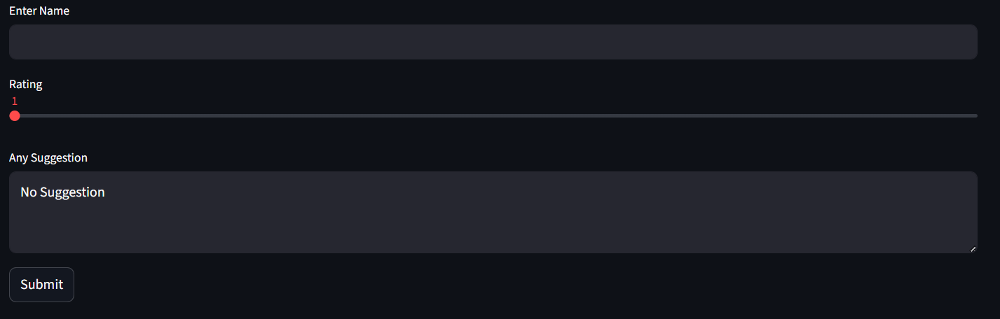

# 👜 Job Market Analysis Dashboard

An End to End Data Analysis Dashboard on Data Related Jobs to uncover trends, and job market patterns.

## ✅ About
An interactive Streamlit dashboard analyzing job market trends, skills demand, salary distribution, and hiring insights using Plotly visualizations and PostgreSQL integration.

## 💾 Data Collection
- The data was collected through web scraping from [Internshala](https://internshala.com/jobs/artificial-intelligence-ai,data-science,machine-learning-jobs) 
- Tools Used : Python libraries such as BeautifulSoup and Requests
- Output : Raw Scraped Data
- **Note: Since the data is sourced from a live website, it is dynamic in nature and may vary or change over time.**

## 🧹 Data Cleaning & Preprocessing
- Handled missing/null values
- Standardized text fields and corrected data types
- Transformed raw data into structured format for analysis
- Output : Cleaned Data

## 📊 Feature Engineering & Exploratory Data Analysis (EDA)
- Created derived features such as:
   - Job Category
   - Experience Level
   - Salary Category
   - Skill Count
   - Improved data interpretability for visualization
- Output : Final Data
- Analyzed distributions, patterns, and trends in data
- Identified key insights such as:
  - Top Job Category
  - Demanding Skills
  - Experience Level
  - Job Across Cities
- Google colab : You can open and run EDA notebook directly on Google Colab without setting up anything locally:
[colab notebook](https://colab.research.google.com/drive/1-XBQ0-rwQRHUvb86O--YimKNq2zuDf16)

## 🛢️ SQL
- Cleaned data stored in PostgreSQL database.
- Tables designed for structured querying.
- Data validated using SQL queries.

## 🧮 Dashboard
- Built an interactive web dashboard using Streamlit
- Added filters for dynamic exploration
- Integrated visualizations using Plotly
- Displayed KPIs and insights in dashboard

## 🧩 User Feedback
- A feedback system was implemented in the Streamlit dashboard to collect user inputs.
- Users can submit:
   - Name
   - Rating
   - Suggestions
- The submitted data is validated and then stored directly into a SQL database using SQLAlchemy.
- This enables continuous collection of real-time user feedback for future analysis and improvement of the dashboard.

## 🖥️ Dashboard Preview
- Main dashboard landing page

- Key Charts (EDA visuals)

- Feedback form

- KPI Cards

## 🚀 Deployment
- Application deployed using Streamlit Cloud
- Ensured public access to dashboard.
- Optimized performance for live usage.
- **App Link : [Click Here](https://projects-hf8xwkasne3nshvpiqfazr.streamlit.app/)**